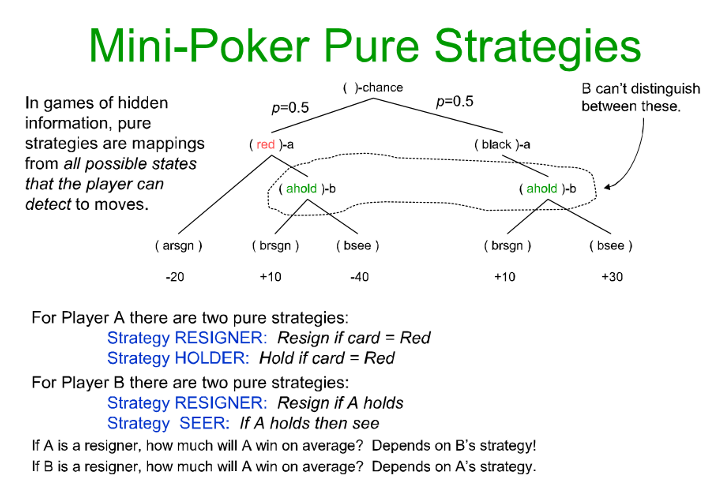

# Mini Poker

## Description

Andrew Moore's mini poker game whose specifications are given below in the figure, find optimal policies for players A and B.

## Usage

Defining the strategy of Player A, beat two different Player B's on average in 200,000 games.

`python minipoker.py`

## Notes

Unlike Ekrem Abi, Player A's strategy must hold over infinitely repeated games.

